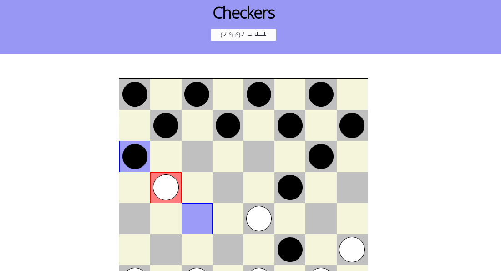

# Checkers JS

This is a simple version of the game Checkers for the browser. I'm building this
to consolidate on my knowlege of ES6 and DOM manipulation.

At the moment I have basic functionality, except that pieces are not "crowned" when
they reach the other edge of the board. I'm working on it!

WIP version is deployed to [https://reflective-lawyer.surge.sh](https://reflective-lawyer.surge.sh).